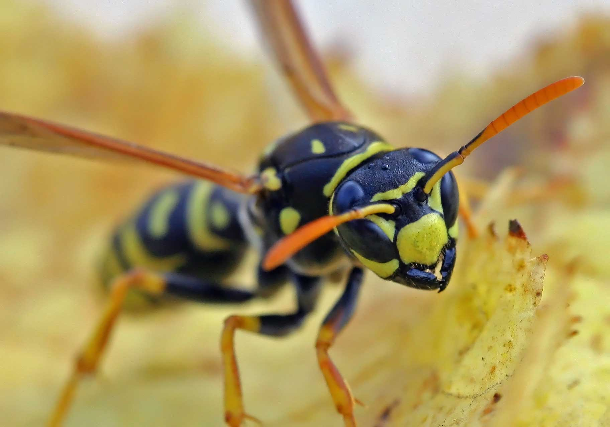



   
  
Image credit: <a href="http://commons.wikimedia.org/wiki/File:Polistes_dominulus_(%3Dgallicus)_-_head_(2005-10).jpg">Wikimedia Commons</a>

**[HymHub]({{ site.url }})** is a data resource supporting comparative genomics research with a focus on social insects, their solitary relatives, and important outgroups.
The purpose of HymHub is to facilitate genome analysis by gathering data from disparate sources, consolidating it into a consistent and easily digestible format, and provide basic templates for exploratory data analysis with popular software packages such as R and Python.

## What can I do with HymHub?

* Go to [fig**share**](link coming soon) to download genome sequences (Fasta), annotations (GFF3), and summary data tables (TSV) for all sequenced Hymenopteran genomes.
* Go to [GitHub](http://github.com/BrendelGroup/HymHub) to download the code we used to build these data files and construct them yourself on your local computer.
* Check out our [interactive IPython notebooks and Rmd files](link coming soon) for tips to get started analyzing the data.
* Use our [GitHub issue tracker](http://github.com/BrendelGroup/HymHub/issues) to tell us about any issues with the data or our code.

## Where does the data come from?

We have done our best to locate and incorporate as much relevant data as possible from the [NCBI FTP site](ftp://ftp.ncbi.nlm.nih.gov/genomes).
We've also included some data from [HymenopteraBase](http://hymenopteragenome.org/), as well as some unpublished data produced by our lab members and collaborators.

## But HymHub doesn't include data for my favorite Hymenopteran!

Has its genome been sequenced, assembled, and annotated?
Is the relevant data publicly available, or would you be willing to make it publicly available?
If so, send us a note with information about how we can access the data.
Or even better, [fork](https://help.github.com/articles/fork-a-repo/) our [GitHub repository](http://github.com/BrendelGroup/HymHub), add instructions for downloading and incorporating your data, and send us a [pull request](https://help.github.com/articles/using-pull-requests/).
